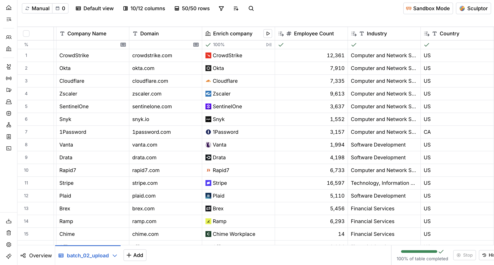
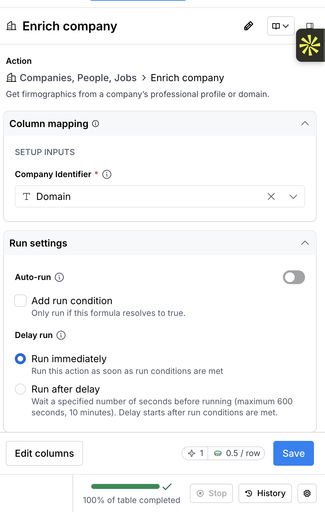
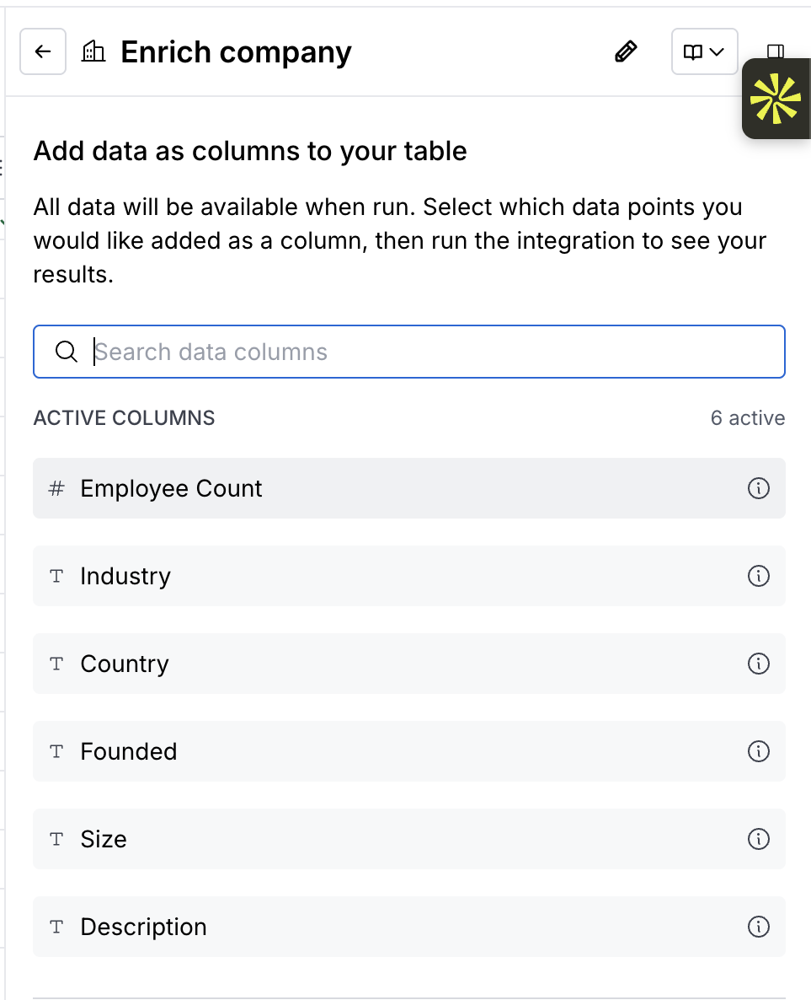
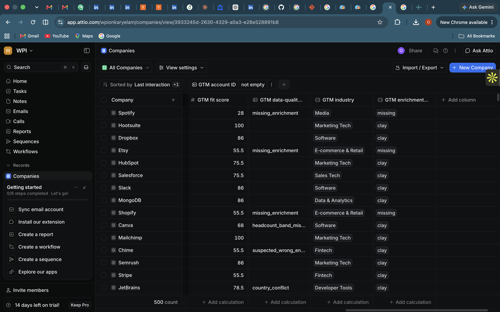
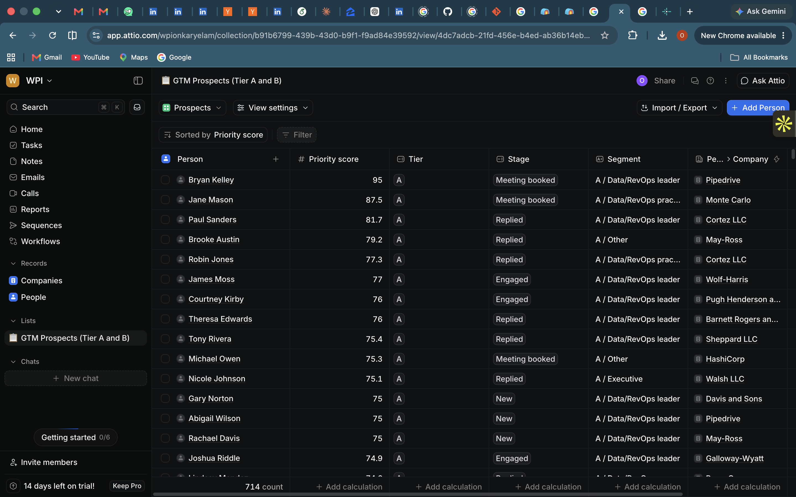
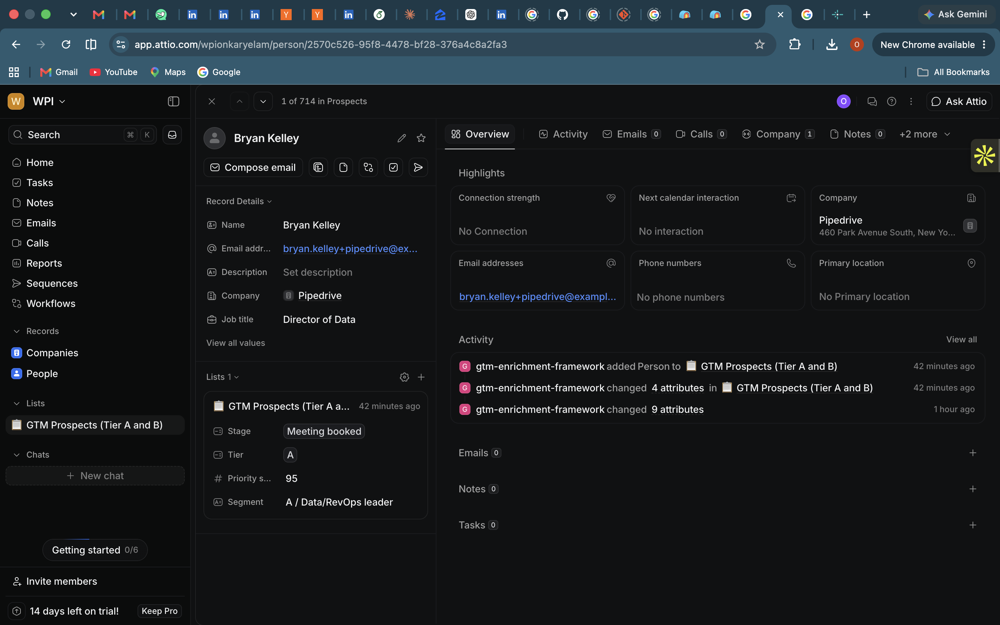

# GTM Enrichment & Outbound Automation Framework

A simulated B2B sales-operations pipeline: synthetic accounts and contacts are
enriched with **Clay**, standardized and validated with **Python + SQL (dbt, DuckDB)**,
scored and segmented, synced to **Attio** via its REST API, and used to draft
personalized outbound emails with an **LLM API**, with dashboards on top.

> **Simulated data. No real emails are sent.** Company names and domains for the
> Clay-eligible accounts are real and public; every contact is synthetic and uses
> a reserved `.test` email domain. Buying signals (`sim_*` columns) are simulated.
> Independent project, not affiliated with any employer.

## Status

| Week | Scope | Status |
| --- | --- | --- |
| 1 | Repo, synthetic data with planted errors, DuckDB raw load, Clay enrichment (100 real companies), mock enricher | Done |
| 2 | dbt staging and marts, dedup, conflict resolution, 16 validation checks, planted-vs-caught report | Done |
| 3 | Priority scoring and A/B/C tiers, idempotent Attio API sync | Done |
| 4 | LLM drafting and evaluation, dashboards, Airflow DAG | Planned |

## Architecture

```
generate (Python, Faker) -> raw (DuckDB) -> enrich (Clay CSV / mock) -> dbt staging + marts
   -> validate (dbt tests, Python) -> score + segment -> Attio (REST API)
   -> LLM drafts + eval -> dashboards (Streamlit)
```

## Quickstart

```bash
python3 -m venv .venv && source .venv/bin/activate
make setup
cp .env.example .env       # add keys later (Attio, Gemini)
make all                   # week1-3: data, enrichment, dbt build, DQ report, scores, Attio dry run
make attio-smoke           # then attio-sync, once ATTIO_API_KEY is in .env
make test
```

Then follow [docs/clay_setup.md](docs/clay_setup.md) to enrich the real accounts in Clay.

## Clay enrichment

100 real companies were enriched in Clay (two 50-row tables on the free plan) with the
**Enrich company** action, keyed on domain, at 0.5 credits per row. Results were
exported as CSV and loaded into `raw.raw_clay_enrichment` by `make clay-load`.



| Enrichment setup (keyed on Domain, auto-run off) | Output fields |
| --- | --- |
|  |  |

What the real enrichment surfaced, before any cleaning:

- 100 of 100 companies matched back to the seed accounts by domain.
- Country disagrees with the seed for 3 companies (Snowflake, Collibra, JetBrains).
- 70 of 100 came back with the broad label "Software Development", so a mapping
  layer is needed to get useful industry segments.
- Founded year is missing for 26 of 100.
- `chime.com` resolved to "Chime Workplace" with 14 employees, a likely wrong-entity
  match that a sanity check on headcount vs. size band should flag.

## Week 2: transform and validate (dbt)

`make week2` runs `dbt build` (models and tests together), then writes
[docs/dq_report.md](docs/dq_report.md).

| Layer | Models | What happens |
| --- | --- | --- |
| staging | `stg_accounts`, `stg_contacts`, `stg_enrichment`, `stg_engagement` | types, normalized emails and domains, titles parsed into seniority and department, enrichment pivoted to one row per account |
| intermediate | `int_contacts_deduped` | exact dedup on normalized email (best record survives), fuzzy name match flagged for review |
| intermediate | `int_accounts_resolved`, `int_enrichment_conflicts` | seed vs enrichment resolved field by field, with the rule recorded |
| marts | `dim_account`, `dim_contact`, `fct_engagement` | clean, deduplicated, quarantined records removed |
| quality | `dq_failures`, `dq_summary`, `dq_planted_detail`, `dq_planted_vs_caught` | every failed check with its action, pass rates, recall against planted errors |

### Results

| Planted error | Planted | Caught |
| --- | --- | --- |
| Duplicate contacts | 100 | 100 |
| Missing titles | 100 | 100 |
| Invalid emails | 60 | 60 |
| Stale records | 60 | 60 |
| Orphan contacts | 20 | 20 |
| Conflicting industry | 10 | 5 (5 of 5 detectable) |

2,101 raw contacts become 1,921 clean contacts: 100 duplicates merged, 60 invalid
emails and 20 orphans quarantined. Missing titles and stale records stay, flagged.

**Industry trade-off.** Clay labels most tech companies "Software Development",
including security, fintech and health companies. Treating that label as specific
would catch 8 of 10 planted conflicts but wrongly overwrite the industry of 9 real
companies (Vanta, Drata, Plaid, Hinge Health and others). The pipeline treats generic
labels as uninformative instead: fewer planted conflicts caught, no false overrides.

**Real-data findings.** Chime matched to "Chime Workplace" with 14 employees against
its own 1,001-5,000 size band (flagged as a suspected wrong entity), 3 country
disagreements, and 13 companies whose headcount has outgrown their size band.

Checks are enforced in dbt: schema tests on every mart, plus singular tests that fail
the build if any rule-based check misses a planted error or if a quarantined record
reaches `dim_contact`.

## Week 3: prioritize and sync to Attio

### Scoring (`dbt/models/marts/fct_prospect_scores.sql`)

Every clean contact gets a 0-100 priority score from four parts. Weights and tier
thresholds are dbt vars in `dbt/dbt_project.yml`, so changing them is one edit and
one rerun.

| Part | Weight | Built from |
| --- | --- | --- |
| Fit | 40% | industry in ICP (100) / adjacent (60) / other (20), headcount band, country |
| Role | 25% | seniority x department: Data and RevOps leaders score highest |
| Engagement | 20% | meetings, replies, visits, opens, each halving in value every 30 days |
| Intent | 15% | simulated signals: hiring for data roles, funded in the last 12 months, tech match |

| Tier | Rule | Contacts | Share |
| --- | --- | --- | --- |
| A | priority 62 and up | 163 | 8.5% |
| B | 50 to 61.9 | 551 | 28.7% |
| C | below 50 | 1,207 | 62.8% |

Each contact also gets a stage from its engagement (New, Engaged, Replied, Meeting
booked) and a segment (tier + persona, e.g. "A / Data/RevOps leader").

### Attio sync (`src/attio/`)

| Step | What it does |
| --- | --- |
| Schema | creates `gtm_` custom attributes on Companies and People and a "GTM Prospects" list, only if missing |
| Companies | upserts 500 companies keyed on `gtm_account_id`, with fit score, industry, enrichment source, DQ flags |
| People | upserts 1,921 people keyed on `gtm_contact_id`, linked to their company, with score, tier, persona |
| Prospects list | adds tier A and B contacts with stage, tier, score and segment; removes contacts that drop to C |

- **Idempotent.** Every record carries our external ID (`gtm_account_id`,
  `gtm_contact_id`). Where Attio allows unique custom attributes, the sync upserts on
  that ID in one call; where it doesn't, it finds the record by ID and then updates
  or creates it. Payloads are hashed, so a second run sends zero writes, and
  `make attio-verify` confirms one Attio record per ID.
- **Rate limits.** Writes are paced under Attio's 25/second, 429s wait for
  `Retry-After`, 5xx errors back off exponentially.
- **Bad values don't stop the run.** If Attio rejects a value (for example a reserved
  `.example` domain), that record is retried without it and the drop is logged.
- **Inspectable.** Sync state lives in the warehouse: `attio.record_map`,
  `attio.sync_runs`, `attio.sync_errors`.
- **Tested without the network.** `tests/test_week3.py` runs the full sync against an
  in-memory fake of the Attio API, including reruns, tier changes and rejected values.

### Live sync results

| Run | Companies | People | Prospects list | API writes |
| --- | --- | --- | --- | --- |
| First full sync | 500 | 1,921 (all linked to their company) | 714 | 3,509, 0 failed |
| Rerun | 500 unchanged | 1,921 unchanged | 714 unchanged | 0 |
| Verify | 500 in Attio, 0 duplicate IDs | 1,921 in Attio, 0 duplicate IDs | | |

Attio rejected the synthetic `.example` domains on 382 companies; those were saved
without a domain and logged, and the run carried on.

**Companies with pipeline fields** (fit score, resolved industry, enrichment source,
and data-quality flags such as Chime's `suspected_wrong_entity`):



**GTM Prospects list** (tier A and B, ranked by priority, stage from engagement):



**A synced person** (linked company, list stage, tier, score and segment):



See [docs/attio_setup.md](docs/attio_setup.md) to connect your own workspace.

## What Week 1 produces

| Output | Rows | Notes |
| --- | --- | --- |
| `raw.raw_accounts` | 500 | 118 real public domains, 382 synthetic `.example` domains |
| `raw.raw_contacts` | ~2,100 | includes planted duplicates and bad records |
| `raw.raw_engagement` | ~2,700 | opens, web visits, replies, meetings over 90 days |
| `raw.raw_clay_enrichment` | ~1,500 values | long format: one row per account and field |
| `raw.planted_errors` | 350 | manifest of every error injected on purpose |

### Planted data-quality errors

Every error is logged in `planted_errors.csv`, so Week 2 validation can report
**planted vs caught** for each check.

| Error | Rate | Example |
| --- | --- | --- |
| Duplicate contacts | 5% | same person with upper-cased email, swapped letters in name, stray whitespace |
| Missing titles | 5% | blank `title` |
| Invalid emails | 3% | missing `@`, double `@`, no TLD, space in local part |
| Stale records | 3% | `source_updated_at` 400 to 900 days old |
| Orphan contacts | 1% | `account_id` that doesn't exist |
| Conflicting industry | 2% of accounts | seed industry disagrees with enrichment |

The mock enricher also behaves like a real provider: LinkedIn-style industry labels,
some missing values, some stale enrichment dates, and noisy headcounts.

## Repo layout

```
config/settings.yaml     seeds, sizes, error rates, Clay column mapping
src/generate/            synthetic data + error injection
src/load/                raw loads into DuckDB
src/clay/                Clay export, mock enricher, Clay export loader
src/attio/               Attio client, schema setup, idempotent sync
src/llm/                 (week 4)
dbt/                     staging, intermediate, marts, quality models + tests
src/validation/          data-quality report generator
tests/                   pytest
docs/                    Clay guide, sample data, decisions log
```

## Tools

Python, pandas, Faker, DuckDB, dbt Core, Clay, Attio API, Gemini or Claude API,
Streamlit, pytest, ruff. Built with Cursor and Claude Code; every output is checked
against the planted-error manifest and tests.
